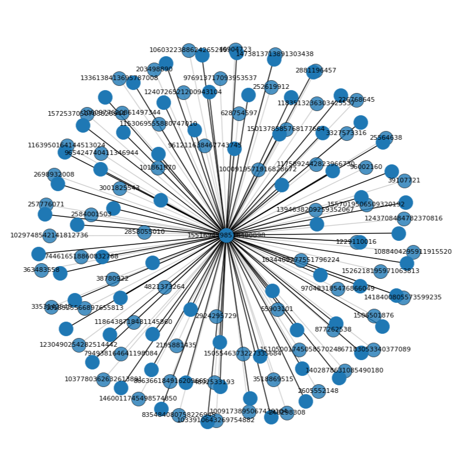
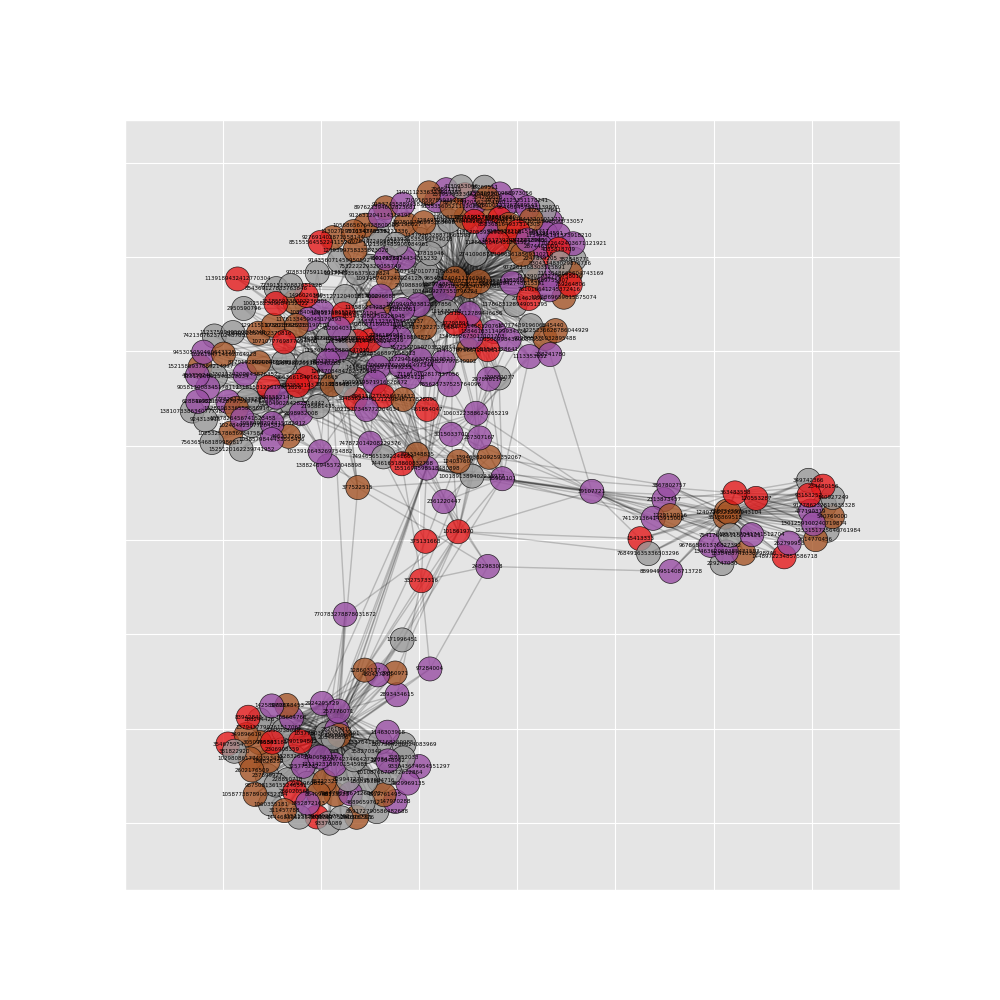

<div align="justify">


# Analisando conexões de perfis e tweets do Twitter


<div style="display: inline-block;">
 
 


</a> 
</div>

# 1. Grafos

A ideia básica de grafos surgiu com o matemático Leonhard Euler no século XVIII (1735). Ele usou grafos para resolver o famoso problema das 7 pontes de Konigsberg.


<div align="center">
 <p> </p>
 
  <p> </p>
 <figcaption>Figura 1: Configuração das pontes na cidade de Königsberg. </figcaption>
 <p> </p>
</div>

> *A cidade de Königsberg, na Prússia, foi definida em ambos os lados do rio Pregel , e incluía duas grandes ilhas — Kneiphof e Lomse — que estavam conectadas entre si, ou às duas porções continentais da cidade, por 7 pontes. O problema era planejar um passeio pela cidade que cruzasse cada uma dessas pontes uma vez e apenas uma vez.*

A solução de Euler foi primeiro remover tudo que fosse irrelevante ao problema, ou seja, remover as cidades próximas, ruas conectadas e deixou apenas o que precisava em vértices que se ligavam baseado nas rotas possíveis. Isso permitiu a ele formular o problema de forma abstrata, iniciando o que temos hoje em teoria dos grafos.

<div align="center">
 <p> </p>
 
  <p> </p>
 <figcaption>Figura 2: Visualização de grafos utilizando o problema das 7 pontes de Konigsberg. </figcaption>
 <p> </p>
</div>


Por que é necessário saber teoria dos grafos? Para responder esta pergunta, utilizaremos um exemplo de aplicação muito comum atualmente: suponha que um ponto representa uma pessoa, e que linhas entre esses pontos representam relações, juntando pares de pessoas que você segue. Então no final, para cada pessoa que você seguir, vai ter uma ligação. Se for analisado o perfil de uma das pessoas que você segue, ela tem um conjunto de pessoas que também segue outros. Algo que poderia ser usado com esse grafo, é recomendar seguidores. Essa lógica é usada para a maioria das redes sociais.

## 1.1 Networkx

NetworkX é uma biblioteca Python para estudar grafos e redes. Esta é uma demonstração de código para mostrar como usamos o NetworkX para conduzir a comparação de subgráficos e manipulamos os parâmetros para desenhar os grafos.

Grafos em networkX podem ser criados de algumas maneiras diferentes:

- Podemos carregar um grafo de um arquivo contendo uma lista de adjacências.
- Podemos carregar um grafo de um arquivo contendo uma lista de arestas (edge list).
- Podemos criar um grafo a partir de uma matriz de adjacência.
- Podemos criar um gráfico a partir de um dataframe do pandas.
- Podemos criar um grafo vazio e adicionar os vértices e arestas um a um ou a partir de uma lista.
- Finalmente, alguns gráficos especiais (gráficos completos, gráficos bipartidos completos, …) podem ser criados usando funções especiais.

# 2. Twitter

> Twitter é uma plataforma para as pessoas conversarem sobre assuntos do momento, um lugar que cria uma audiência muito engajada, que fica ao nosso alcance — seja por meios orgânicos ou anúncios pagos.

**_Jenny Broekemeier, Gerente de Mídias Sociais Pagas da MANSCAPED, Inc._**

Trata-se de uma rede social bastante difundida, onde seu usuário poder realizar publicações, chamados de tweets que podem conter, textos, imagens, vídeos, hiperlinks ou todos deles integrados. Essas publicações podem ser visualizadas por diversos usuários e que eventualmente poderão republicar aquela "mensagem" em uma operação conhecida como retweet.

## 2.1 API

Para consumir dados do Twitter, não é necessário ter acesso aos servidores e bancos de dados internos do Twitter, também não é preciso entender como o Twitter é codificado. É necessário um intermediário entre o usuário e o back-end do Twitter, um intermediário em que o clinte pode solicitar (com alguns parâmetros) para obter alguns dados ou interagir com os serviços do Twitter. Em poucas palavras, uma API é isso: simplesmente uma junção entre dois aplicativos independentes que se comunicam entre si. Como abstração, a API do Twitter simplifica a integração com terceiros (desenvolvedores, aplicativos, outras APIs, etc.).


<div align="center">
 <p> </p>
 
   <p> </p>
 <figcaption>Figura 3: Funcioamento da API.</figcaption>
 <p> </p>
 <p> </p>
</div>

Aqui está o que se pode fazer com a API do Twitter:

- Pesquisar tweets programaticamente com base em hashtags, palavras-chave, geolocalização, etc.
- Criar bots do Twitter que retuitam automaticamente uma lista de contas predefinidas
- Transmitir tweets em tempo real com base em uma série de filtros
- Seguir automaticamente uma lista de usuários
- etc.

Logo, a API permite que você execute programaticamente qualquer ação que executaria manualmente na interface.

# 3. Social network analysis ou Análise de rede social
 
A noção de rede social refere-se historicamente à abordagem estrutural de estudo dos grupos sociais. O conceito, que tem suas raízes na Sociologia há quase um século, principalmente através do trabalho do Jakob Moreno, ainda na década de 30, que sistematicamente coletou e analisou as interações sociais de alunos de escolhas, é uma das principais bases do que ele chamava de Sociometria. Na base, rede social significava a visão de um grupo social através de suas relações, considerando o grafo (estrutura de rede) como construto para tal.


<div align="center">
 <p> </p>
 
  <p> </p>
 <figcaption>Figura 4: Um dos grafos originais do Moreno, do livro "Who shall survive" (1934). </figcaption>
 <p> </p>
</div>

 Outros autores, depois de Moreno, também se apropriaram do conceito para seus estudos e setaram outras bases para o que depois veio a se tornar a Análise de Redes Sociais. Mas foi apenas na década de 90 que aconteceu uma mudança radical: Com o surgimento da mídia digital e a transformação das interações sociais em dados, novas formas de estudar esses grupos sociais, principalmente de forma mais massiva (a análise de redes sociais era feita com trabalho de coleta de dados mais "formiguinha" até então). Essa nova abordagem, muito mais interdisciplinar, vai ser inaugurada por autores como Barabási e Christakis, entre outros, e notadamente, vai também originar outras novas "subáreas" de estudo em áreas que tradicionalmente não estudavam dados sociais (como a Ciência Social Computacional, por exemplo).
 
Quando transformamos essa discussão para as redes sociais online ou as redes sociais na internet, o que temos é uma mudança importante entre uma estrutura mediada principalmente pelas relações institucionais e interpessoais e uma estrutura mediada pelas relações mediadas pela tecnologia digital. Nessas mudanças, essas redes ganham “superpoderes”, tais como:

- A possibilidade de conexão mais “individual” e por interesse, não limitada pela localização geográfica;
- A posssibilidade de conexões massivas, em grande escala (uma vez que essas conexões podem ser mantidas pelas ferramentas sem a necessidade de interação social), assim permitindo que as pessoas tenham centenas ou milhares de “amigos” — o fenômeno dos “influenciadores”, por exemplo;
- A possibilidade de participação em conversações globais e de acesso a conteúdos que não necessariamente estariam disponíveis devido à complexificação das conexões sociais;
- A possibilidade de ser alguém diferente, ter mais de um “perfil”, brincar com a própria identidade (o que também possibilita que coisas que não poderiam ser atores em redes sociais offline, como um perfil robô, por exemplo, agora possam ser).

Logo, de acordo com a Wikipédia,

> “A análise de redes sociais (SNA) é o processo de investigação de estruturas sociais por meio do uso de redes e teoria dos grafos. Caracteriza as estruturas em rede em termos de nós (atores individuais, pessoas ou coisas dentro da rede) e os laços, arestas ou links (relacionamentos ou interações) que os conectam.

Ele entrou em praticamente todos os campos - novamente, de acordo com a Wikipedia:

> “A análise de redes sociais emergiu como uma técnica chave na sociologia moderna. Também ganhou seguidores significativos em antropologia, biologia, demografia, estudos de comunicação, economia, geografia, história, ciência da informação, estudos organizacionais, ciência política, saúde pública, psicologia social, estudos de desenvolvimento, sociolinguística e ciência da computação e agora é comumente disponível como uma ferramenta de consumo (consulte a lista de software SNA).”
 
 
# 4. O Algoritmo

## 4.1 Problema Proposto 

Neste trabalho o objetivo é aplicar as estruturas em grafos para solucionar um problema real qualquer. Cada dupla de alunos deve escolher em literatura uma das áreas de aplicação do tema e propor uma solução baseada nos conceitos apresentados. Essa solução pode ser realizada utilizando C, C++ e/ou Python. O objetivo e mostrar a atuação de algoritmos clássicos em grafos na resolução de problemas emergentes. Alguns temas para inspiração são: Análise de rede social, rotas de entregas, análise de trafego (i.e., carros, pacotes na internet, etc), mínima quantidade de saltos em redes, teoria dos jogos, elaboração de horário vs rodízio de salas, envoltória convexa (do inglês, convex hull), etc.

Desta forma, o seguinte trabalho consiste em:

1) Usuário com mais conexões em uma rede local:    
	1) Usar o Tweepy para raspar o Twitter para todos os meus seguidores e (a maioria) de seus seguidores;     
	2) Criar um DataFrame pandas de todas essas conexões;     
	3) Usar o NetworkX para extrair uma rede desses dados e executar algumas análises básicas de rede;     
	4) Visualizar a rede no Gephi.    
2) Assuntos mais comentados em uma rede local:     
	1) A partir do usuário com maior numero de conexões, extrair os 20 tweets mais recentes de cada um de seus seguidores;     
	2) Tratar estes tweets utilizando regex, codecs e nltk;     
	3) Utilizando os tweets tratados, criamos nós com palavras únicas, e ligamos essas palavras através de arestas com as outras palavras do tweet;     
	4) A cada repetição de palavra e aresta adicionamos um valor ao item referente a estes, e no final plotamos o grafo usando o matplotlib.    

## 4.2 Instalação

Para rodar este código, é necessário instalar as bibliotecas a seguir.

```
pip3 install networkx
pip3 install codecs
pip3 install nltk
nltk.download('stopwords')
pip3 install tweepy
pip3 install community
pip3 install python-louvain
pip3 install ipython
```

## 4.3 Bibliotecas utilizadas

https://github.com/barbrina/Twitter-Data-Analysis/blob/85e61f9f72a316351deb559c4158657fecbd8a2e/Final/Etapa1.py#L1-L7

As ferramentas utilizadas foram:

- Tweepy — um tipo de API RESTful especificamente para o Twitter
- NetworkX — uma biblioteca Python para estudar gráficos e redes.
- Pandas — biblioteca de manipulação e análise de dados
- Matplotlib — biblioteca de plotagem
- JSON — tipo de arquivo
- Gephi — um pacote de software de análise e visualização de rede de código aberto
- Regex — excluir dados estranhos(pontuação, espaço duplo, linha vazia, emojis, links, etc)
- Codecs — salvar com codificação utf-8(manter acentos)
- Nltk — remover stopwords

## 4.4 Estrutura do algoritmo

Para extrair dados do Twitter devem ser seguidas as seguintes etapas. Em primeiro lugar, você deve obter as credenciais da API do Twitter no site do desenvolvedor do Twitter, que são a chave da API, a chave secreta da API, o token de acesso e o segredo do token de acesso.

### <b>4.4.1 Criação de um aplicativo do Twitter e configurção das credenciais</b>

Para poder reproduzir as etapas a seguir é necessário ter uma conta no Twitter. Para usar a API do Twitter, primeiro precisa-se registrar como desenvolvedor do Twitter, no site dos desenvolvedores. Uma vez registrado, e necessário criar um aplicativo do Twitter que irá configurar um monte de credenciais: essas credenciais serão usadas posteriormente pela biblioteca Tweepy para autenticação. 

<div align="center">
 <p> </p>
 
  <p> </p>
 <figcaption>Figura 5: Portal do desenvolvedor do Twitter. </figcaption>
 <p> </p>
</div>

### <b>4.4.2 Conexão à API do Twitter</b>

Para começar, é necessário construir uma rede usando a conta pessoal do twitter. Para fazer isso, utiliza-se uma lista de todos os seguidores. Em seguida, obtêm-se todos os seguidores dos usuarios dessa lista. Para economizar tempo, para contas com mais de 5.000 seguidores, extrai-se apenas os primeiros 5.000 de seus seguidores.

Primeiro, precisamos importar os pacotes Tweepy e pandas.

https://github.com/barbrina/Twitter-Data-Analysis/blob/85e61f9f72a316351deb559c4158657fecbd8a2e/Final/Etapa1.py#L5-L6

Em seguida, precisamos inserir a credenciais da API do Twitter retiradas na sessão **Criação de um aplicativo do Twitter e configurção das credenciais**.

```
consumer_key = info['API_ACCESS']
consumer_secret = info['API_ACCESS_SECRET']
access_key = info['ACCESS_TOKEN']
access_secret = info['ACCESS_TOKEN_SECRET']
```

Com o Tweepy, podemos usar essas credenciais para nos conectar à API do Twitter e começar a baixar os dados. O código a seguir usa apenas as credenciais inseridas acima para se conectar à API. Como vamos fazer o download de grandes conjuntos de dados, é importante especificar alguns parâmetros quando inicializarmos a API. Definimos ‘wait_on_rate_limit’ como True. Existem limites de taxa ao baixar dados do Twitter - você só pode fazer um número limitado de solicitações de download para a API em um determinado período de tempo. Ao definir esses parâmetros como True, não interromperemos a conexão com a API quando atingirmos esses limites. Em vez disso, esperaremos até que o tempo limite termine e possamos continuar baixando os dados.

https://github.com/barbrina/Twitter-Data-Analysis/blob/85e61f9f72a316351deb559c4158657fecbd8a2e/Final/Etapa1.py#L19-L25

### <b>4.4.3 Etapa 1: Usuário mais importante</b>
#### <b>4.4.3.1 Raspagem de dados</b>

Para iniciar o download dos dados, obteremos todos os seguidores de um usuário individual. Para obter isso, você precisa do ID do usuário. Você pode obter o ID de usuário de um usuário se souber seu nome de tela usando o código abaixo.

https://github.com/barbrina/Twitter-Data-Analysis/blob/85e61f9f72a316351deb559c4158657fecbd8a2e/Final/Etapa1.py#L27-L28

Meu ID de usuário é: 1551694598518480898

Uma rede consiste de nós (ou vértices) e links (ou arestas). Para esta rede, usaremos contas de usuários individuais como nós e seguidores como links. Nosso objetivo, portanto, é criar um DataFrame de IDs de usuário com duas colunas: origem (‘source’) e destino (‘target’). Para cada linha, o destino segue a origem. Para começar, queremos listar todos os meus seguidores como alvos.

O código a seguir cria uma lista dos meus 69 seguidores. Agora que temos uma lista de todos os seguidores, podemos colocá-los em um DataFrame.

https://github.com/barbrina/Twitter-Data-Analysis/blob/85e61f9f72a316351deb559c4158657fecbd8a2e/Final/Etapa1.py#L30-L46

Mas esta não é uma rede muito interessante e pouco pode se analisar ela. Para visualizar essa rede simples, podemos usar o pacote NetworkX para converter o DataFrame em um gráfico ou rede. Em seguida, plotamos o gráfico usando matplotlib e o armazenamos em um arquivo.

https://github.com/barbrina/Twitter-Data-Analysis/blob/85e61f9f72a316351deb559c4158657fecbd8a2e/Final/Etapa1.py#L50-L61

O código acima renderiza o seguinte visual:

<div align="center">
 <p> </p>
 
  <p> </p>
 <figcaption>Figura 6: Grafo das minhas conexões no twitter. </figcaption>
 <p> </p>
</div>

O que queremos mesmo é conseguir todos os seguidores desses 69 usuários. Para fazer isso, percorreremos a lista de todos os usuários, obteremos seus seguidores e adicionaremos esses links ao DataFrame original. Este é o código que levará muito tempo para ser executado por causa dos limites de taxa da API do twitter.

https://github.com/barbrina/Twitter-Data-Analysis/blob/85e61f9f72a316351deb559c4158657fecbd8a2e/Final/Etapa1.py#L65-L91

Esse código é muito semelhante ao código acima, pois obtém todos os seguidores de um determinado ID de usuário. A grande diferença é que ao invés de alimentar apenas uma conta, estamos passando por todas as 69 contas que me seguem. Outra diferença é que se uma conta tiver mais de 5.000 seguidores, pegamos apenas os primeiros 5.000 seguidores. Isso ocorre devido à maneira como a API funciona. Cada solicitação de API retornará apenas 5.000 contas. Portanto, se quisermos todos os seguidores de uma conta que tenha, digamos, um milhão de seguidores, precisaríamos fazer 200 solicitações individuais.

Por causa dos limites de taxa (rate limits), o código pode levar longos períodos para terminar de obter todos os dados. Ele faz 15 solicitações de API, depois espera 15 minutos, faz outras 15 solicitações e assim por diante. Portanto, pode demorar muito.

Feito isso, você deve ter um csv com todas as arestas da rede. Escrevi tudo isso em um csv apenas para que, se ele quebrar durante a execução, eu ainda tenha todas as bordas raspadas.

Agora precisamos ler o csv e transformar o df em um gráfico usando o NetworkX. Depois que os dados forem convertidos em um gráfico, podemos executar algumas análises básicas de rede. 

Podemos encontrar os nós mais influentes na rede usando medidas de centralidade. A medida mais simples de centralidade é o grau de centralidade, que é apenas uma função do número de conexões que cada nó possui. O código a seguir encontra o número de conexões que cada nó possui, ou seja, o grau de cada nó e os classifica em ordem decrescente.

https://github.com/barbrina/Twitter-Data-Analysis/blob/85e61f9f72a316351deb559c4158657fecbd8a2e/Final/Etapa1.py#L94-L103

O nó da minha rede com o grau mais alto é o nó 1034409277551796224 ou @cvdbotasbatidas. cvdbotasbatidas tem um grau de 125. 110 dessas conexões são os 110 seguidores deste nó que raspamos. Mas isso significa que existem 15 conexões adicionais - o que significa que cvdbotasbatidas segue 15 contas que me seguem. Para obtermos o nome de usuário de uma conta, dado o ID do usuário, use o seguinte código, semelhante a como obtivemos nosso ID de usuário acima.

https://github.com/barbrina/Twitter-Data-Analysis/blob/85e61f9f72a316351deb559c4158657fecbd8a2e/Final/Etapa1.py#L105-L106

Como a rede é muito grande agora (mais de 41 mil nós), qualquer análise levará muito tempo para ser executada e qualquer visualização será uma bagunça completa, desta forma, filtrarei a rede para um número mais gerenciável de nós. Isso é feito usando a função k_core do NetworkX. A função k_core filtra os nós com grau menor que um determinado número, k. Neste exemplo, defino k igual a 4, o que reduz o número de nós no gráfico para cerca de 300.

#### <b>4.4.3.2 Análise de conexões</b>

Com esse gráfico menor, podemos facilmente fazer algumas análises de rede. Começamos dividindo o gráfico em grupos usando um <a href="https://github.com/barbrina/Twitter-Data-Analysis/wiki/Analisando-conex%C3%B5es-de-perfis-pessoais-do-Twitter">algoritmo de detecção de comunidade</a>. Dessa forma, nós precisamos executar o código de centralidade de grau novamente agora que nossa rede é menor. Agora que temos os nós divididos em grupos e o grau de cada nó, nós os combinamos em um DataFrame. Em seguida, podemos visualizar este gráfico e salvá-lo em um arquivo png. 

#### <b>4.4.3.3 Visualização no Gephi</b>

Com esse gráfico menor, podemos facilmente fazer algumas análises de rede. Começamos dividindo o gráfico em grupos usando um algoritmo de detecção de comunidade. Dessa forma, nós precisamos executar o código de centralidade de grau novamente agora que nossa rede é menor. Now that we have the nodes split into groups and the degree of each node, we combine these into one DataFrame. Agora que temos os nós divididos em grupos e o grau de cada nó, nós os combinamos em um DataFrame. Em seguida, podemos visualizar este gráfico e salvá-lo em um arquivo png. 

https://github.com/barbrina/Twitter-Data-Analysis/blob/85e61f9f72a316351deb559c4158657fecbd8a2e/Final/Etapa1.py#L110-L136

Isso deve criar um gráfico parecido com isto:

 <div align="center">
 <p> </p>
 
  <p> </p>
 <figcaption>Figura 7: Grafo de todas as conexões. </figcaption>
 <p> </p>
</div>

#### <b>4.4.3.4 Visualização no Gephi</b>

Em seguida, exportaremos os arquivos para o formato csv e usaremos o Gephi para visualizar. Gephi é um software de análise e visualização de rede de código aberto. Você deve ser capaz de instalá-lo facilmente gratuitamente no site deles.

Para usar o Gephi, primeiro é necessário exportar a lista de nós e a lista de arestas como arquivos csv.

https://github.com/barbrina/Twitter-Data-Analysis/blob/85e61f9f72a316351deb559c4158657fecbd8a2e/Final/Etapa1.py#L138-L142

### <b>4.4.4 Etapa 2 - Assunto mais importante</b>

Para descobrir o assunto mais importante da rede do usuário mais influente seguimos a seguinte tática:

1) Extraímos os tweets de todos os seguidores do Usuário mais influente;
2) Tratamos esses tweets, de maneira a deixar somente palavras importantes;
3) Construímos um grafo utilizando as palavras como nós, e as vezes qe se repetiram como tamanho dos nós. As arestas são feitas das conexões entre palavras em um tweet e o peso da aresta é derivado da quantidade de vezes que essa conexão aparece;
4) São retiradas as palavras de menos importância (aparecem menos que 100 vezes) e as conexões que elas fazem;
5) Plota-se o grafo.

#### <b>4.4.4.1 Extração de Tweets</b>

Extraímos o id usuário mais influente do arquivo "nodes.csv";

https://github.com/barbrina/Twitter-Data-Analysis/blob/ddf123a492798b6a2c42deed7efaaea0e50ed2af/Final/Etapa2.py#L2617

Cria-se uma lista de seguidores e ela é preenchida com os seguidores do usuário mais influente;

https://github.com/barbrina/Twitter-Data-Analysis/blob/ddf123a492798b6a2c42deed7efaaea0e50ed2af/Final/Etapa2.py#L2619-L2626

A partir dos ids encontrados (excluindo-se os que possuem twitter privado), obtemos os 20 tweets mais recentes dos mesmos (a quantidade foi estabelecida como consenso geral entre o grupo de média de tweets por dia de um usuário);

https://github.com/barbrina/Twitter-Data-Analysis/blob/ddf123a492798b6a2c42deed7efaaea0e50ed2af/Final/Etapa2.py#L2628-L2641

#### <b>4.4.4.2 Tratamento de texto</b>

Para não ser necessária a repetição da pesquisa, já que temos limite de pesquisas, salva-se os tweets em um arquivo, com uma sequência de caracteres(;;;) no final de cada tweet, que será utilizada para quebrar os tweets depois do tratamento. E como tratamento inicial, retira-se todos os emojis do tweet com a função [deEmojify](https://gist.github.com/slowkow/7a7f61f495e3dbb7e3d767f97bd7304b?permalink_comment_id=4071933#gistcomment-4071933).     
A seguir fazemos o tratamento adicional de todos os tweets, removendo caracteres e links, e stopwords, utilizando as bibliotecas Regex e Nltk:

https://github.com/barbrina/Twitter-Data-Analysis/blob/ddf123a492798b6a2c42deed7efaaea0e50ed2af/Final/Etapa2.py#L2649-L2664

#### <b>4.4.4.3 Construção do grafo</b>

Utilizando a sequência de caracteres definida, quebramos os tweets em um array (*data_set=texto.split("; ; ;")*). Em seguida começamos a criar nosso grafo:

https://github.com/barbrina/Twitter-Data-Analysis/blob/ddf123a492798b6a2c42deed7efaaea0e50ed2af/Final/Etapa2.py#L2564-L2599

A classe possui as seguintes funções:

 - <font size="3"><b> \_\_init\_\_:</b></font> Responsável por criar os dicionários(serão usados como Hash) para armazenar os nós(Palavras e repetições) e as arestas(ligações de palavras e repetições);
 - <font size="3"><b>addNode(palavra):</b></font> Adiciona 10 a posição de chave **palavra** do dicionário de nós, toda vez que esta **palavra** aparece;
 - <font size="3"><b>addEdge(a,b):</b></font> Utilizando um *frozenset(a,b)* como chave(qualquer ordem das duas palavras será considerada igual), adiciona 1 a posição com esta chave toda vez que as palavras aparecem juntas;
 - <font size="3"><b>visualize:</b></font> Responsável por desenhar o grafo.

Para cada tweet presente na lista (*data_set*) percorremos o mesmo palavra por palavra, adicionando cada palavra como nó (**addNode()**) e cada par de palavra prensente no tweet como aresta (**addEdge()**);

https://github.com/barbrina/Twitter-Data-Analysis/blob/ddf123a492798b6a2c42deed7efaaea0e50ed2af/Final/Etapa2.py#L2668-L2674

A seguir utilizamos a função visualize da classe de grafo, essa função funciona da seguinte maneira:

 1) Remove nós que possuem valores abaixo de 1000 (aparecem menos de 100 vezes), e removem as arestas que possuem esses nós

 https://github.com/barbrina/Twitter-Data-Analysis/blob/ddf123a492798b6a2c42deed7efaaea0e50ed2af/Final/Etapa2.py#L2578-L2582

 2) Cria as arestas no estilo da biblioteca networkx e adiciona em ordem, os grafos da classe e as arestas criadas a partir das arestas da classe

 https://github.com/barbrina/Twitter-Data-Analysis/blob/ddf123a492798b6a2c42deed7efaaea0e50ed2af/Final/Etapa2.py#L2583-L2589

 3) Ajusta o layout da grafo (posicionamento, tamanho de nós, label de aresta)

 https://github.com/barbrina/Twitter-Data-Analysis/blob/ddf123a492798b6a2c42deed7efaaea0e50ed2af/Final/Etapa2.py#L2590-L2594

 4) Plota o grafo

 https://github.com/barbrina/Twitter-Data-Analysis/blob/ddf123a492798b6a2c42deed7efaaea0e50ed2af/Final/Etapa2.py#L2595-L2599


## 5. Resultados e Análises

Através do Gephi, pudemos gerar um grafo das conexões.

 <div align="center">
 <p> </p>
 
  <p> </p>
 <figcaption>Figura 9: Primeiro grafo plotado no Gephi. </figcaption>
 <p> </p>
</div>

Inicialmente, os dados importados ao Gephi parecem confusos. Agora, executamos uma visualização em nossos dados. Na seção “Distribuição” eu escolho “ForceAtlas″ porque é rápido e bom em mostrar relacionamentos em uma rede.


<div id="image-table">
    <table>
	    <tr>
    	    <td style="padding:10px">
        	     
      	    </td>
            <td style="padding:10px">
            	 
            </td>
        </tr>
    </table>
</div>

<div align="center">
<p> Figura 10: Grafo de cores definidos por grupos e por graus de saída, respectivamente. </p>
</div>


## 6. Conclusão
 
## 7. Compilação e Execução

</div>


## 8. Referências Bibliográficas

Mota M. **_Grafos — Conceitos Básicos_**. Internet: https://medium.com/20-21/grafos-ac48e874570

Recuero R. **_Mídia social, plataforma digital, site de rede social ou rede social? Não é tudo a mesma coisa?_**. Internet: https://medium.com/@raquelrecuero/m%C3%ADdia-social-plataforma-digital-site-de-rede-social-ou-rede-social-n%C3%A3o-%C3%A9-tudo-a-mesma-coisa-d7b54591a9ec, 2019;

Jain S, Sinha A. **_Identification of influential users on Twitter: a novel weighted correlated influence measure for Covid-19_**. Chaos, Solitons & Fractals, 2020.

Ferreira M. **_Coletando dados do Twitter utilizando Python - Parte 1_**. Internet: https://www.linkedin.com/pulse/coletando-dados-do-twitter-utilizando-python-parte-1-mauro-ferreira/, 2021.

Besbes A. **_How To Extract Data From The Twitter API Using Python_**. Internet: https://towardsdatascience.com/how-to-extract-data-from-the-twitter-api-using-python-b6fbd7129a33, 2022.

Galarnyk M. **_How to Access Data from the Twitter API using Tweepy (Python)_**. Internet: https://towardsdatascience.com/how-to-access-data-from-the-twitter-api-using-tweepy-python-e2d9e4d54978, 2022.

Tijesunimi O. **_Mining Data on Twitter_**. Internet: https://medium.com/@tijesunimiolashore/mining-data-on-twitter-3c7969207e75, 2020.

Hedden S. **_How to download and visualize your Twitter network_**. Internet: https://towardsdatascience.com/how-to-download-and-visualize-your-twitter-network-f009dbbf107b, 2021.

Popova J. **_Network Analysis and Community Detection on Political Tweets_**. Internet: https://medium.com/mlearning-ai/network-analysis-and-community-detection-on-political-tweets-9e0f21294e31, 2022.

Shaham F. **_Generating A Twitter Ego-Network & Detecting Communities_**. Internet: https://towardsdatascience.com/generating-twitter-ego-networks-detecting-ego-communities-93897883d255

Hammer L. **_Guide: Analyzing Twitter Networks with Gephi 0.9.1_** Internet: https://medium.com/@Luca/guide-analyzing-twitter-networks-with-gephi-0-9-1-2e0220d9097d

Aric A. Hagberg, Daniel A. Schult and Pieter J. Swart, **_Exploring network structure, dynamics, and function using NetworkX_**, in Proceedings of the 7th Python in Science Conference (SciPy2008), Gäel Varoquaux, Travis Vaught, and Jarrod Millman (Eds), (Pasadena, CA USA), pp. 11–15, Aug 2008

Parika P. **_Analysis Of Twitter Social Network_**. Internet: https://medium.com/social-media-theories-ethics-and-analytics/analysis-of-twitter-social-network-d5023e1a1aa, 2020. 

## 9. Integrantes

<div>
<p align="justify"> <b> Bárbara Braga Gualberto Correa </b> </p>

<div>
<p align="justify"> <b> Gabriel Couto Assis </b> </p>

<div>
<p align="justify"> <b> Pablo Sousa da Silva </b> </p>

<div>
<p align="justify"> <b> Thaissa Vitória Guimarães Daldegan de Sousa </b> </p>

